## MIPS Assembly
### Brief Description of MIPS Architecture
For being a good MIPS assmebly programmer, first we have to know about the architecture of MIPS processors. So, first of all, I am going to summarize the architecture of MIPS precisely below.

**MIPS**, which stands for **M**icroprocessor without **I**nterlocked **P**ipelined **S**tages is a **RISC** (**R**educed **I**nstruction **S**et **C**omputer) ISA developed by MIPS Technologies (in the US).

MIPS architecture is a 32-bit structure, which means that data are 32-bit wide in this architecture. In the following [figure](https://en.wikipedia.org/wiki/MIPS_architecture_processors#/media/File:MIPS_Architecture_(Pipelined).svg), the overview of the pipelined MIPS architecture can be seen.

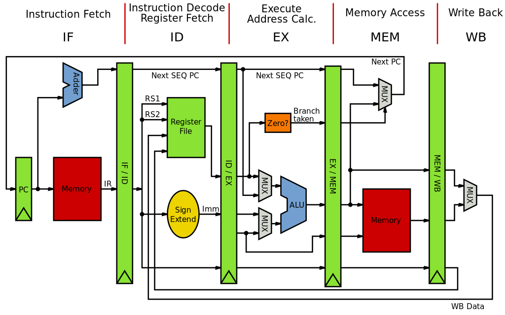

Additionally, there are 3 instruction categories which can be checked in the following figure.

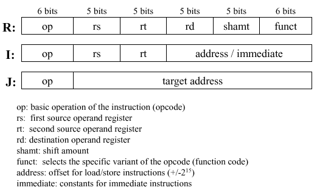

Besides RF (Register File, which contains 32 registers of 32-bit wide), there are **PC** (Program Counter) register, which points the instruction which is going to be fetched for the next time, and **HI** and **LO** (HI and LO are called multiply/ divide registers), which store the higher and lower order bits of the result of the multiplication.

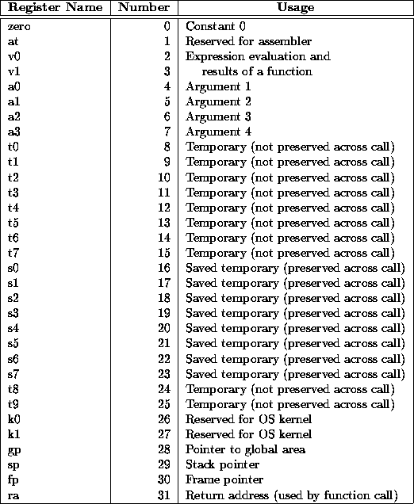

R-type (Register Access) instructions

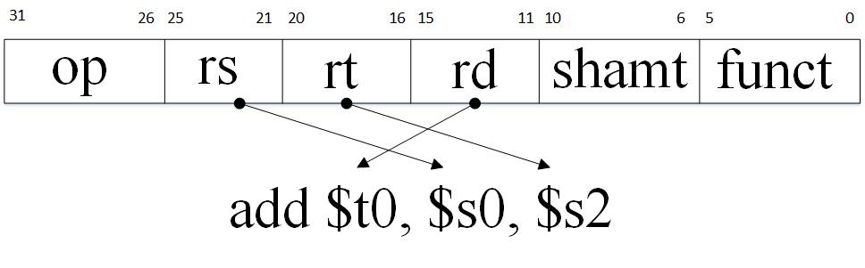

I-type (Immediate) instructions - bne and beq instructions which are in MIPS conditional branch instructions are from I-type.

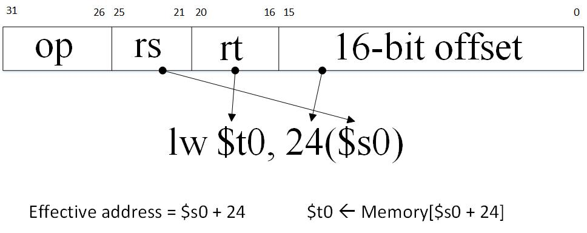

J- Type (Jump) instructions

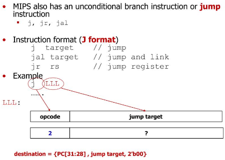

In the following figures, you can get a complete knowledge of the MIPS instructions.

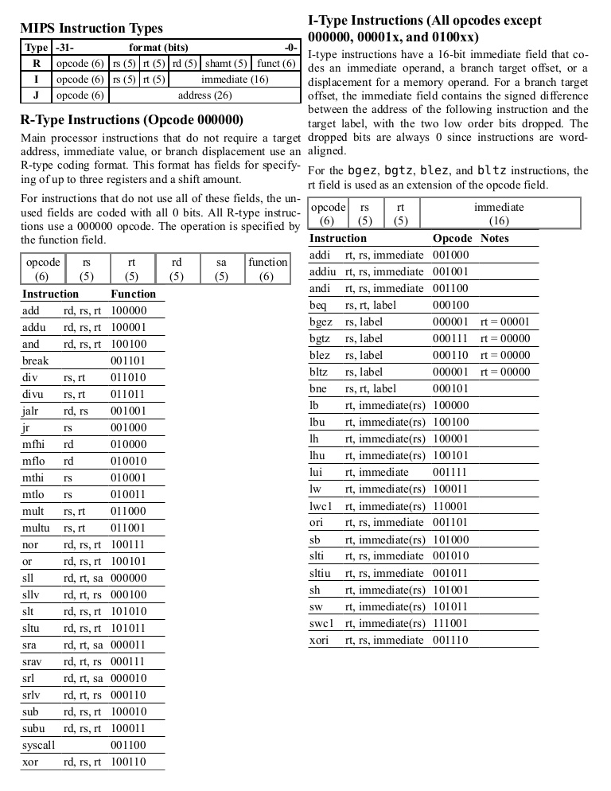

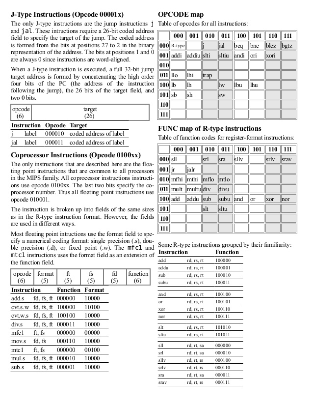

In the **jal** instruction, the return address will be stored in the $31 register.

The following figure is a list of MIPS instruction set, which each programmer needs to take a look at while programming MIPS processors.

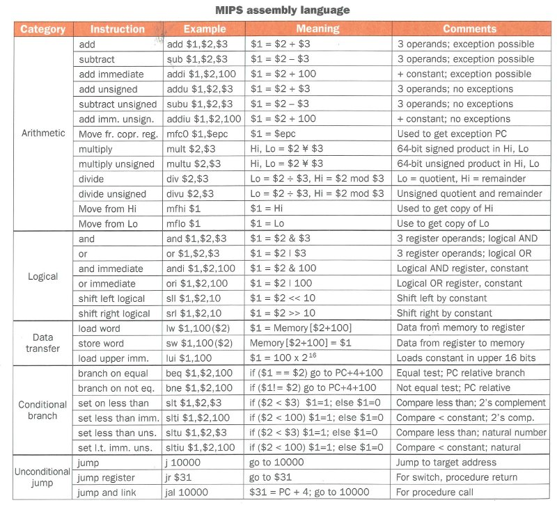

### MIPS assembly Examples
#### [Some high level snippets in MIPS assembly](codes/01-start.asm)

```
# x = y + z
add $s0, $s1, $s2

# x = y - z
sub $s0, $s1, $s2

# x[11] = x[10] + y
lw	$t0, 40($s0)
add $t1, $t0, $s1
sw  $t1, 44($s0)

 # f($s0) = g($s1) - A($s6)[B($s7)[4]]
 lw $t0, 16($s7)
 sll $t0, $t0, 2 # because in MIPS pc <- pc + 4 and also every word is consisted of 4 bytes
 add $t0, $t0, $s6
 lw  $t0, 0($t0)
 sub $s0, $s1, $t0

 # for (int i($t0) = 0; i < 10; i++)
 #  	A($s0)[i] = A[i - 1] + B($s1)[i];

 add $t0, $zero, $zero # i <-- 0
LOOP:
subi $t1, $t0, 1 // i - 1
sll  $t1, $t1, 2 // (i - 1) * 4
add  $t1, $s0, $t1
lw   $t1, 0($t1)

add  $t2, $t0, $zero
sll  $t2, $t2, 2
add  $t2, $s1, $t2
lw   $t2, 0($t2)

add  $t3, $t1, $t2 # A[i - 1] + B[i] 

add  $t4, $t0, $zero
sll  $t4, $t4, 2
add  $t4, $t4, $s0
sw   $t3, 0($t4)

addi $t0, $t0, 1
slti $t5, $t0, 10 # if i < 10 $t5 = 1 else $t5 = 0
bne  $t5, $zero, LOOP
EXIT:
```

#### IEEE 754 Floating Point Representation
- Established in 1985 by IEEE
- IEEE 754 has three basic components;
  - The sign of Mantissa
    - zero: positive
    - one:  negative
  - The biased exponent
    - Single precision bias: +127  = 2^(8 - 1) - 1
    - Double precision bias: +1023 = 2^(11 - 1) - 1
  - The normalized Mantissa

##### IEEE 754 - Single Precision


##### IEEE 754 - Single Precision

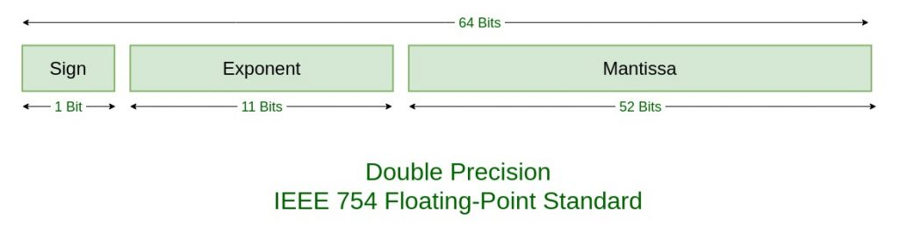

To read more about floating point representation of IEEE 754, go to this [link](https://www.geeksforgeeks.org/ieee-standard-754-floating-point-numbers/) and read more, where I borrowed the two recent figures from there.

### MIPS Assembly Programming
For simulating MIPS processors, MARS simulator can be used to execute the assembly code of MIPS, and also show the values stored in the registers (First of all, you have to have Java installed on your machine - JRE/ JDK). You can google for MARS simulator for MIPS processors and easily get it.

In the following starting code, we say hello to assembly programming.
```
.data
	message: .asciiz	 "Hello World! \n"

.text
	li $v0, 4
	la $a0, message
	syscall 
```

The execution of the code above will produce the following result in the MARS simulator.

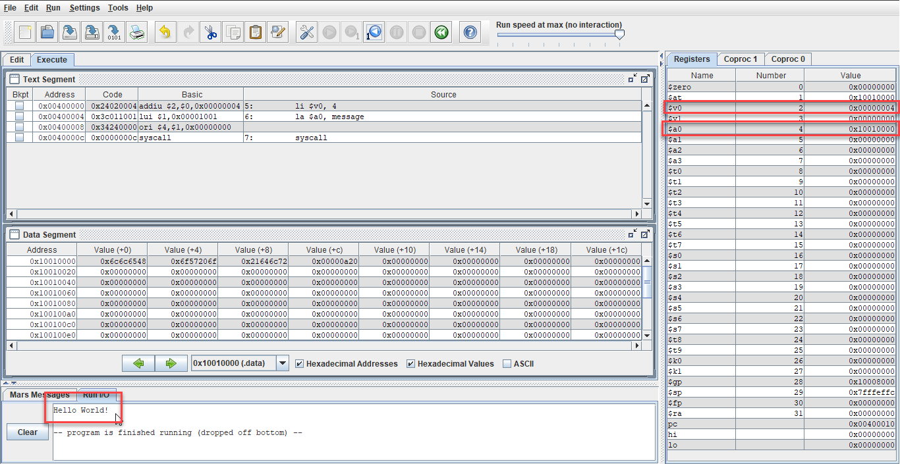