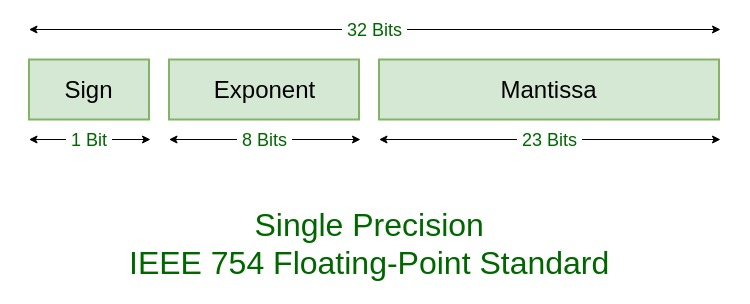

# MIPS Assembly
## Brief Description of MIPS Architecture
For being a good MIPS assmebly programmer, first we have to know about the architecture of MIPS processors. So, first of all, I am going to summarize the architecture of MIPS precisely below.

**MIPS**, which stands for **M**icroprocessor without **I**nterlocked **P**ipelined **S**tages is a **RISC** (**R**educed **I**nstruction **S**et **C**omputer) ISA developed by MIPS Technologies (in the US).

MIPS architecture is a 32-bit structure, which means that data are 32-bit wide in this architecture. In the following [figure](https://en.wikipedia.org/wiki/MIPS_architecture_processors#/media/File:MIPS_Architecture_(Pipelined).svg), the overview of the pipelined MIPS architecture can be seen.

**NOTE**: RF width in MIPS microprocessor is 32 bit, and memory is addressable for words (4 bytes), so always in word addresses, bits 0 and 1 are zero.


Additionally, there are 3 instruction categories which can be checked in the following figure.


Besides RF (Register File, which contains 32 registers of 32-bit wide), there are **PC** (Program Counter) register, which points the instruction which is going to be fetched for the next time, and **HI** and **LO** (HI and LO are called multiply/ divide registers), which store the higher and lower order bits of the result of the multiplication.


R-type (Register Access) instructions


I-type (Immediate) instructions - bne and beq instructions which are in MIPS conditional branch instructions are from I-type.


J- Type (Jump) instructions


In the following figures, you can get a complete knowledge of the MIPS instructions.


In the **jal** instruction, the return address will be stored in the $31 register.

The following figure is a list of MIPS instruction set, which each programmer needs to take a look at while programming MIPS processors.


**NOTE**: MIPS processors consider the immediate values in instructions as the following figure shows [ref](https://www.youtube.com/watch?v=1bP6alXjDrw&list=PLylNWPMX1lPnipZzKdCWRj2-un5xvLLdK&index=4).


**NOTE**: For loading 32-bit wide values we have to use '**lui register, 16-bit_value**' and '**ori register, 16-bit_value**' together like as follows. 


### MIPS assembly Examples
#### [Some high level snippets in MIPS assembly](codes/01-start.asm)

```python
# x = y + z
add $s0, $s1, $s2

# x = y - z
sub $s0, $s1, $s2

# x[11] = x[10] + y
lw	$t0, 40($s0)
add $t1, $t0, $s1
sw  $t1, 44($s0)

 # f($s0) = g($s1) - A($s6)[B($s7)[4]]
 lw $t0, 16($s7)
 sll $t0, $t0, 2 # because in MIPS pc <- pc + 4 and also every word is consisted of 4 bytes
 add $t0, $t0, $s6
 lw  $t0, 0($t0)
 sub $s0, $s1, $t0

 # for (int i($t0) = 0; i < 10; i++)
 #  	A($s0)[i] = A[i - 1] + B($s1)[i];

 add $t0, $zero, $zero # i <-- 0
LOOP:
subi $t1, $t0, 1 // i - 1
sll  $t1, $t1, 2 // (i - 1) * 4
add  $t1, $s0, $t1
lw   $t1, 0($t1)

add  $t2, $t0, $zero
sll  $t2, $t2, 2
add  $t2, $s1, $t2
lw   $t2, 0($t2)

add  $t3, $t1, $t2 # A[i - 1] + B[i] 

add  $t4, $t0, $zero
sll  $t4, $t4, 2
add  $t4, $t4, $s0
sw   $t3, 0($t4)

addi $t0, $t0, 1
slti $t5, $t0, 10 # if i < 10 $t5 = 1 else $t5 = 0
bne  $t5, $zero, LOOP
EXIT:
```
##### **REMEMBER**: beq and bne only compare registers and registers. To compare a register with a constant we have to:
- Load the constant into a register (addi)
- Compare the registers (bne/ beq)


#### IEEE 754 Floating Point Representation
- Established in 1985 by IEEE
- IEEE 754 has three basic components;
  - The sign of Mantissa
    - zero: positive
    - one:  negative
  - The biased exponent
    - Single precision bias: +127  = 2^(8 - 1) - 1
    - Double precision bias: +1023 = 2^(11 - 1) - 1
  - The normalized Mantissa

##### IEEE 754 - Single Precision



##### IEEE 754 - Single Precision


To read more about floating point representation of IEEE 754, go to this [link](https://www.geeksforgeeks.org/ieee-standard-754-floating-point-numbers/) and read more, where I borrowed the two recent figures from there.


---

## MIPS Assembly Programming
### BASICS

For simulating MIPS processors, MARS simulator can be used to execute the assembly code of MIPS, and also show the values stored in the registers (First of all, you have to have Java installed on your machine - JRE/ JDK). You can google for MARS simulator for MIPS processors and easily get it.

In the following starting code, we say hello to assembly programming ([see the asm file](codes/02-Hello_Assembly.asm)).
```python
.data   # stored in RAM
	message: .asciiz	 "Hello World! \n"

.text   # instructions
	li $v0, 4  # by loading 4 into $v0, system know that something is going to be printed on the screen
	la $a0, message  # load address, goes to the RAM and from that address starts to bring data until it reaches the '\n'
	syscall 
```

The execution of the code above will produce the following result in the MARS simulator.


[This](codes/03-printing_a_char.asm) assembly program shows how to print a character on the screen. Note that we have to use single quotes for the character we want to define in the .data section. If, we use double quotations, we are going to encounter errors.
```python
.data
    a_character: .byte	'e'
    
.text
    li  $v0, 4
    la  $a0, a_character
    syscall
```
In [this file](codes/04-different_types_print.asm), I tried to print many different types of data.
```python
.data
	an_integer: .word 25

.text
	li $v0, 1		# By loading 1 into $v0, we say the processor that we want to print an integer
	lw $a0, an_integer	# Instead of loading from a address which its end is going to be detected, just load a word
	syscall
  ```
In the following example, an integer, then newline, and then a floating-point number is printed.
```python
.data
	new_line: .asciiz "\n"
	an_integer: .word 25
	a_float: .float 25.4

.text
	li $v0, 1		# By loading 1 into $v0, we say the processor that we want to print an integer
	lw $a0, an_integer	# Instead of loading from a address which its end is going to be detected, just load a word
	syscall
	
	li $v0, 4
	la $a0, new_line
	syscall
	
	li $v0, 2
	lwc1 $f12, a_float	# $f12 is in co-processor, so we have to use lwcl
	syscall
```

The following figure shows the result of the execution of the code above.


The following code lists how to print differnt values on screen
```python
.data
	new_line: .asciiz "\n"
	an_integer: .word 25
	a_float: .float 25.4
	a_double: .double 34.23
	zero_double: .double 0.0

.text
	li $v0, 1		# By loading 1 into $v0, we say the processor that we want to print an integer
	lw $a0, an_integer	# Instead of loading from a address which its end is going to be detected, just load a word
	syscall
	
	li $v0, 4
	la $a0, new_line
	syscall
	
	li $v0, 2
	lwc1 $f12, a_float	# $f12 is in co-processor, so we have to use lwc1
	syscall
	
	li $v0, 4
	la $a0, new_line
	syscall
	
	ldc1  $f2, a_double
	ldc1  $f0, zero_double
	
	li $v0, 3
	add.d $f12, $f2, $f0
	syscall
```

##### Adding
[file](codes/05-addition.asm)

```python
.data
	number1: .word -115
	number2: .word 13432
	
.text
	lw	$t0, number1($zero)
	lw	$t1, number2($zero)
	
	add 	$t2, $t0, $t1		# $t2 <-- $t0 + $t1
	
	# for printing the result
	li $v0, 1			# to print an integer, load immediate $v0 with 1
	move  $a0, $t2			# ~= add $a0, $zero, $t2
	syscall
```

##### Subtraction
[file](codes/06-subtraction.asm)

```python
.data
	number1: .word -115
	number2: .word 13432

.text
	lw	$t0, number1($zero)
	lw	$t1, number2($zero)
	
  sub 	$t2, $t0, $t1		# $t2 <-- $t0 - $t1
	
	# for printing the result
	li $v0, 1			# to print an integer, load immediate $v0 with 1
	move  $a0, $t2			# ~= add $a0, $zero, $t2
	syscall
```

##### Multiplication
[mul](codes/07-multiplication.asm)

```python
.data
    	number1: .word -3
	number2: .word 12
    	number3: .word 0

.text
	lw $t0, number1($zero)
	lw $t1, number2($zero)
	
	# instead of doing what we load from memory, we can do as follows
	addi $t0, $zero, -3
	addi $t1, $zero, 12
	
	mul $t2, $t1, $t0 		# $t2 <-- $t1 * $t0
	
	# for printing the result
	li $v0, 1			# to print an integer, load immediate $v0 with 1
	move  $a0, $t2			# ~= add $a0, $zero, $t2
	syscall
```

##### More sophisticated multiplication
[mult](codes/07-mult.asm)

```python
.data
	new_line: .asciiz "\n"
	
.text
	addi $t0, $zero, 2000
	addi $t1, $zero, 100
	
	mult $t0, $t1
	
	mflo $s0
	mfhi $s1
	
	# display the product to the screen
	li $v0, 1
	add $a0, $zero, $s0
	syscall
	
	# newline print 	
	li $v0, 4
	la $a0, new_line
	syscall
	
	
	addi $t0, $zero, 1000
	sll $s0, $t0, 1
	
	# display the product to the screen
	
	li $v0, 1
	add $a0, $zero, $s0
	syscall
```

##### Division
[div](codes/08-div.asm)

```python
.data

.text
	addi $t0, $zero, 200
	addi $t1, $zero, 20
	
	div $t0, $t0, $t1 # $t0 <--- $t0 / $t1
	
	# display the product to the screen
	li $v0, 1
	add $a0, $zero, $t0
	syscall
```

Using LO and HI registers [link to source code](codes/09-division-prim.asm) - Note that the quotient is going to be kept in LO register, and HI register is going to kept the remainder.
```python
.data

.text
	addi $t0, $zero, 200
	addi $t1, $zero, 20
	
	div $t0, $t1

    	mflo $t0
	
	# display the product to the screen
	li $v0, 1
	add $a0, $zero, $t0
	syscall
```

### PROCEDURES in MIPS
Procedures avoid code redundancy and increase usability of the code and also eases the programming.

For saying to the system that a program is done, we need the following code.
```python
li $v0, 10
syscall 
```

For jumping to procedures, we have to save the return address to be able to come back when the procedure is done. So, we use 'jal label' instruction for jumping to the procedures. Also, at the end of the procedure, we have to use 'jr $ra' to return to where we were executing (jal saves PC+4 in the R32 or $ra).
```python
jal Label # J-Type instruction


Label:
    # ins 1
    # ins 2

    # ...

    jr $ra
```

See this [example](codes/11-procedure1.asm).

But when we hear procedure, we recall function in high level programming languages, and also we want to know more about arguments and return values of a procedure. We are going to use $a1 to $a4 as our arguments, and we are going to store our results in $v1. See this [example](codes/12-procedure-with-arguments-return-value.asm).

```python
.data

.text
	addi $a1, $zero, 100
	addi $a2, $zero, 10
	
	# for addition, put your numbers in $a1 and $a2, then you can find your result in $v1
	jal addition
	
	add $a0, $v1, $zero # passing the number that we want to print it
	
	# for print, just put the number you want to be printed in the $a0
	jal integer_print
	
	# return 0;
	li $v0, 10
	syscall 


	addition:
		add $v1, $a1, $a2
		jr $ra
		
	integer_print:
		li $v0, 1
		syscall 
		jr $ra
```

#### Stack
Stack can be used for the evaluation of postfix expressions. It's main application is in nested procedures when R31 ($ra) is not able to keep the return address. By convention, if $si registers are used inside a procedure and we need the data after returning from that procedure we have to save them, but for $ti s, there is not such a convention. See example [here](codes/13-saving-to-stack.asm). As I think about it, I feel that this statment is right when we have lots of data and we need to work with registers, and finally we have to push it in stack not to lose it! If you have any comment, feel free to ping me on this!

```python
.data
        new_line: .asciiz "\n"
.text
main:
    addi $s0, $zero, 10

    jal incremet

    # print a newline
    li $v0, 4
    la $a0, new_line
    syscall 

    # print value
    li $v0, 1 # integer print
    move $a0, $s0
    syscall

# return 0; ~= signal for the end of the program
li $v0, 10
syscall

incremet:
            addi $sp, $sp, -4
            sw $s0, 0($sp)    # pushing to the stack

            addi $s0, $s0, 30

            # Print new value in function
            li $v0, 1
            move $a0, $s0
            syscall

            lw $s0, 0($sp) # poping from the stack
            addi $sp, $sp, 4

            jr $ra
```

#### Nested Procedures
For correct implementation of this concept, we have to use the stack of the processor because we have just one register ($ra) to save the return address. See the example [here](codes/14-nested_procedures.asm).

```python
.data
        new_line: 	.asciiz "\n"

.text
main:
    addi $s0, $zero, 10

    # assumes that the value should be in $t0 to be printed
    add $t0, $s0, $zero

    # this function assumes, we have our value in $s0
    add $s0, $t0, $zero
    jal incremet

    # print a newline
    jal print_newLine    
    
    # assumes that the value for print is in the $t0
    add $t0, $zero, $s0
    jal print_integer

# return 0; ~= signal for the end of the program
li $v0, 10
syscall

# this procedure receives input in $s0 and increments it and gives it out in $s0
incremet:
            addi $s0, $s0, 1
            
            # when we are in a procedure if we are going to jump, first we have to push the return addresss in the
            # stack, otherwise we are going to lose the return address and change to a orphan :D
            addi $sp, $sp, -4
            sw $ra, 0($sp)    # pushing the current return address to the stack     
            jal print_integer
            

            # After returning from a procedure we have to retrieve our previous return address and just (-/+4) :D because
            # every 4 bytes is a word in MIPS for us (4-byte-aligned or word-aligned actions in MIPS :S)
				
            lw $ra, 0($sp) # poping from the stack
            addi $sp, $sp, 4

            jr $ra
            
print_integer:
            	li $v0, 1
            	move $a0, $t0
            	syscall
            	
            	jr $ra	

print_newLine:
    			li $v0, 4
    			la $a0, new_line
    			syscall
    		
    			jr $ra
```

**Note**: It is important to remember that we are the programmer and we can use our tool freely. So, the first key fact to be a good programmer is to understand the basics and use the computing system freely. For example in each procedure when we are going to push the current return address to the stack, we can push other registers values too, consider context switching.

##### Getting input from User
[Getting integers from the user](codes/15-input_int.asm). The only thing here is to put '5' into $v0 and then 'syscall'.
```python
.data
	message1: .asciiz "Enter Your Age: "
	message2: .asciiz "\nYour Age is: "
	newline: .asciiz "\n"
.text
	jal print_string1
	
	# Getting integer from the user
	li $v0, 5
	syscall
	
	move $a1, $v0
	# the entered integer now is in $v0
	
	jal print_string2
	
	jal print_integer
	
	# return 0; end of the program
	li $v0, 10
	syscall

print_newline:
	li $v0, 4
	la $a0, newline
	syscall
	
	jr $ra

print_string1:
	li $v0, 4
	la $a0, message1
	syscall
	
	jr $ra
	
print_string2:
	li $v0, 4
	la $a0, message2
	syscall
	
	jr $ra

# assumes that the input will be in the $a1		
print_integer:
	li $v0, 1
	add $a0, $zero, $a1
	syscall
	
	jr $ra
```

[Getting floats from the user](codes/16-input_float.asm)

```python
.data
	message1: .asciiz "Enter PI: "
	message2: .asciiz "\nThe PI is: "

    zeroFloat: .float 0.0
.text

    	lwc1 $f4, zeroFloat

	jal print_string1
	
	# Getting float from the user
	li $v0, 6
	syscall
	# the entered integer now is in $f0 in the co-processor
	
	jal print_string2
	
	jal print_float
	
	# return 0; end of the program
	li $v0, 10
	syscall

print_string1:
	li $v0, 4
	la $a0, message1
	syscall
	
	jr $ra
	
print_string2:
	li $v0, 4
	la $a0, message2
	syscall
	
	jr $ra

print_float:
	li $v0, 2
	add.s $f12, $f0, $f4
	syscall
	
	jr $ra

```

[Getting doubles from the user]()

```python
.data
	message1: .asciiz "Enter PI: "
	message2: .asciiz "\nThe PI is: "

    	zeroDouble: .double 0.0
.text

    	lwc1  $f4, zeroDouble 
	jal print_string1
	
	# Getting double from the user
	li $v0, 7
	syscall
	# the entered integer now is in $f0 in the co-processor
	
	jal print_string2
	
	jal print_double
	
	# return 0; end of the program
	li $v0, 10
	syscall

print_string1:
	li $v0, 4
	la $a0, message1
	syscall
	
	jr $ra
	
print_string2:
	li $v0, 4
	la $a0, message2
	syscall
	
	jr $ra

print_double:
	li $v0, 3
	add.d $f12, $f0, $f4
	syscall
	
	jr $ra
```
[Getting text from the user](codes/18-text_from_user.asm)

```python
.data
	userInput: .space 50
	newline: .asciiz "\n"
.text
	main:
		# Getting user's input as text
		li $v0, 8
		la $a0, userInput
		li $a1, 50 # maximum length of the string = number of bytes
		syscall
	
		
		# printing input
		li $v0, 4
		la $a0, newline
		syscall
		
		li $v0, 4
		la $a0, userInput
		syscall
		
	# return 0; - end of the program
	li $v0, 10
	syscall
```

### Real Structures needed for programming

#### IF ELSE Structure
See how a simple if-else is implemented in assmebly [here](codes/19-if-else-structure.asm).

```python
.data
	message1: .asciiz  "Numbers are EQUAL."
	message2: .asciiz  "Number are not EQUAL."
.text
	main:
		
		addi $t0, $zero, 5
		addi $t1, $zero, 20
		
		beq $t0, $t1, EQ
		# bne $t0, $t1, EQ
		# bge: branch if greater or equal
		# bgt: branch if greater than
		# ble: branch if less or equal
		# blt: branch if less than
		j NEQ
		
		EQ:
			li $v0, 4
			la $a0, message1
			syscall
		
		NEQ:
			li $v0, 4
			la $a0, message2
			syscall
		
		# return 0; syscall to end the program
		li $v0, 10
		syscall 
```

##### slt instruction
```python
# slt: set on less than to one
.data
	msgLess: .asciiz "The number is less than the other!"
	msgNotLess: .asciiz "The number is not less than the other!"
.text
	main:
		addi $t0, $zero, 11
		addi $t1, $zero, 11
		
		add $s0, $zero, $zero
		
		slt $s1, $t0, $t1 # if $t0 < $t1 :: $s1 <--- 1
		
		beqz $s1, NotLess
		
		li $v0, 4
		la $a0, msgLess
		syscall 
		b Exit
		
		NotLess:
			li $v0, 4
			la $a0, msgNotLess
			syscall 
		
		Exit:
		# return 0;
		li $v0, 10
		syscall
```

**NOTE**: We can find many instructions for conditional jumps, but these are going to be translated to the provided instruction by the processor, and the assembler is responsible for this task.

#### Loop
For building loops, the knowledge of using jumps (conditional/ and unconditional) are enough. Look at the following example, which its code is [here](codes/21-while_loop.asm).
```python
.data
	message: .asciiz "While is Done!"
	new_line: .asciiz "\n"
.text
	main:
		# i <- 0
		addi $t0, $zero, 0
		
		while:
			bgt  $t0, 10, exit
			
			addi $t0, $t0, 1	# i <-- i + 1
			
			li $v0, 1
			add $a0, $zero, $t0
			syscall
			
					
			li $v0, 4
			la $a0, new_line
			syscall
			
			j while		
		
		exit:
		
		li $v0, 4
		la $a0, message
		syscall 
		
	# return 0; == end of program
	li $v0, 10
	syscall
```

### Arrays
We can define arrays of bytes with the ".space" in the ".data" section. The only thing that we have to pay attention is that while trying to index the words increment or decrement by 4 (word aligned story).
```python
.data
	an_array: .space 12 # 3 words = 3 x 4 Bytes
	new_line: .asciiz "\n"
.text
	main:
		addi $s0, $zero, 4
		addi $s1, $zero, 10
		addi $s2, $zero, 12
		
		addi $t0, $zero, 0
		
		sw $s0, an_array($t0)
			addi $t0, $t0, 4
		
		sw $s1, an_array($t0)
			addi $t0, $t0, 4
			
		sw $s2, an_array($t0)
		
		
		addi $t1, $zero, 0
		
		while:	
			beq  $t1, 12, exit
			
			li $v0, 1
			lw $a0, an_array($t1)
			syscall
			
			li $v0, 4
			la $a0, new_line
			syscall
			
			addi $t1, $t1, 4
			
			j while	
		exit:
	
	li $v0, 10
	syscall
```

Also, an array can be initialized as shown in the following assembly snippet.
```python
.data
		an_array: .word 100:3 # there are 3 elements initialized to 100
```